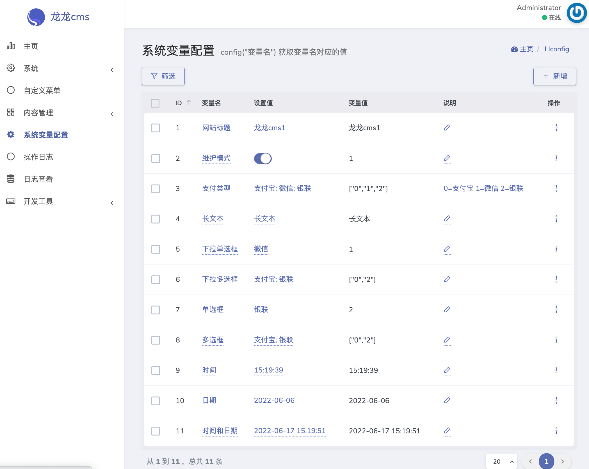
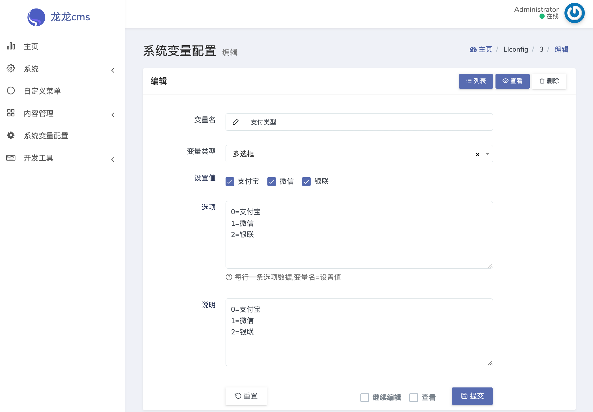

# Dcat extension config

## Requirement

* PHP >= 7.1
* laravel >= 7.0
* dcat-admin >= 2.0

## Installation

### Composer installation

```bash
composer require abyssgoing/dcat-extension-config
```

Enable the extension under `Backend -> Helpers -> Extensions`

## View






# Use
Open the file `app/Providers/AppServiceProvider.php` to load variable configuration.
```php
use Ll\DcatConfig\LlConfig;

public function boot()
{
    if (Schema::hasTable('ll_configs')) {
        LlConfig::load();
    }
}
```

